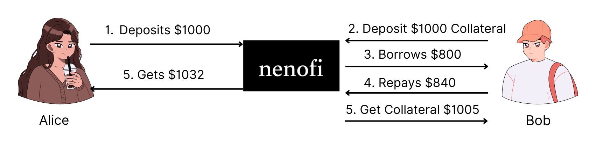

# Nenofi v Traditional Finance

### Traditional Finance

<figure><figcaption></figcaption></figure>

Alice is earning 1% on her savings.\
With a good credit score and cumbersome application process Bob borrows at 7% rate.

**Banks Revenue:** $50\
**Avg Net Profit Margin:** 13%\
**Profit**: $6.5

### Nenofi

<figure><figcaption></figcaption></figure>

Alice is earning 3.2% on her savings.\
Bob borrows at 5% rate while his collateral appreciates in value

**Nenofi Revenue**: $8 \
**Avg Net Profit Margin**: 85%\
**Profit**: $6.5
